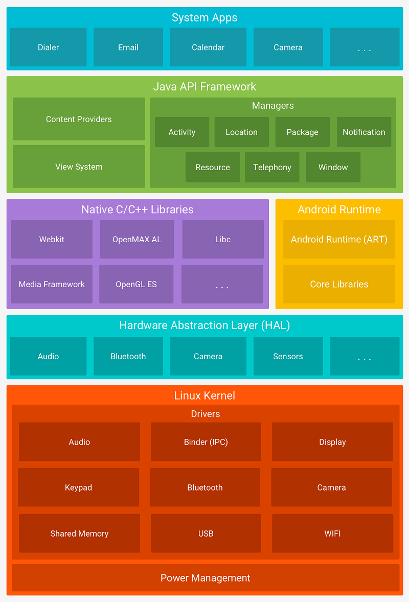

# Android Architecture

## Application Layer (System Apps)

Both built-in and third-party applications belong to the application layer.

## Application Framework Layer (Java API Framework)

The application framework layer provides developers with the APIs needed to develop applications.

This layer is written in Java.

- **Activity Manager** : Manages the lifecycle of applications and provides a common navigation backstack.
- **Location Manager** : Provides APIs to determine the location of the device.
- **Package Manager** : Manages the applications installed on the device.
- **Notification Manager** : Allows applications to display alerts and notifications to the user.
- **Resource Manager** : Provides access to non-code embedded resources such as strings, color settings, and user interface layouts.
- **Telephony Manager** : Provides information about the telephony services on the device.
- **Window Manager** : Manages the windowing system on the device.
- **Content Providers** : Allows applications to publish and share data with other applications.
- **View System** : An extensible set of views used to create application user interfaces.

## Libraries and Android Runtime Layer

### C/C++ Libraries

The libraries in this layer are written in C or C++.

- **Webkit** : Provides a web browser engine used to display web content.
- **OpenMAX AL** : Provides a standardized interface for audio, video, and image codecs.
- **Libc** : Provides a subset of the standard C library (libc), used by the majority of C-based applications.
- **OpenGL|ES** : Provides an interface between software and graphics acceleration hardware.
- **Media Framework** : Provides a unified interface for playing and recording audio and video.
- **SQLite** : Provides a lightweight relational database engine used to access a variety of relational database systems.
- **SSL** : Provides a secure sockets layer (SSL) implementation used to access a variety of secure communications protocols.

### Android Runtime

- **ART/Dalvik Virtual Machine** : A virtual machine optimized for mobile devices, allowing multiple instances of the Virtual Machine to run efficiently in a limited amount of memory. Each Dalvik application runs in its own process, with its own instance of the Dalvik Virtual Machine, and is executed in a separate Linux process.

> Note: Dalvik Virtual Machine is deprecated in Android 4.4 KitKat and replaced by Android Runtime (ART).
>
> This is because Dalvik Virtual Machine uses Just-In-Time (JIT) compilation, which compiles the code when it is needed, while Android Runtime uses Ahead-Of-Time (AOT) compilation, which compiles the code when the application is installed.
>
> This makes Android Runtime faster than Dalvik Virtual Machine.

- **Core Library** : Provides most of the functionality of the Java programming language that are required by the Java API framework and the apps running on Android.

## Hardware Abstraction Layer (HAL)

The hardware abstraction layer (HAL) provides standard interfaces that expose device hardware capabilities to the higher-level Java API framework.

It is the interface between Operating System Kernel and the hardware.

To protect the Intellectual Property rights of the Hardware manufacturers, the source code of the HAL is not available in the Android Open Source Project (AOSP).

And it provides a virtual hardware platform for the operating system.

So that it has hardware independence, and it can be transported to any device.

## Linux Kernel

Android's core system services are based on Linux and are written in C/C++.

The Linux kernel is responsible for managing the core system services such as security, memory management, process management, network stack, and driver model.

It also provides an abstraction layer between the hardware and the rest of the software stack.
