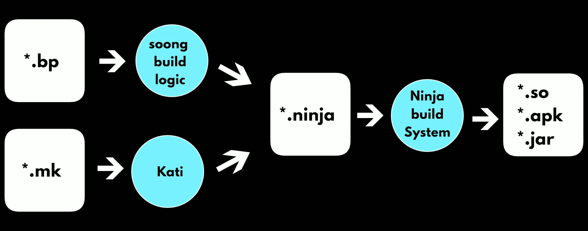

# Android Build System



## envsetup

```bash
source build/envsetup.sh
```

The `envsetup.sh` script imports several commands that enable you to work with the Android source code.

To see the full list of available commands, run:

```bash
hmm
```

## envsetup commands

### lunch

The `lunch` command is used to configure the build environment for a specific target device or product variant, enabling developers to compile and build the Android OS for that device.

It sets up the build environment with the necessary parameters for the chosen configuration, making it a convenient way to prepare the build system before compilation.

---

### croot

The `croot` command is used to change the current directory to the top of the Android source tree.

```bash
croot
```

---

### m

The `m` command is used to build the Android source code.

It makes from top of the source tree.

```bash
m
```

---

### mm

Builds all of the modules in the **current directory**, and but **not** their dependencies.

Inside the module directory (For example, `packages/apps/Calendar/`), run:

```bash
mm
```

This only builds the module. It does not generate the final image.

Final image is generated by `m` command.

> Note: It is useful when we make modification to a module and check if it is building successfully or not.

---

### mma

Builds all of the modules in the **current directory**, and their dependencies.

---

### mmm

Builds all of the modules in the **supplied directories**, and but **not** their dependencies.

Inside the directory (For example, `packages/apps/`), run:

```bash
mmm Calendar launcher3
```

This only builds the module. It does not generate the final image.

> Note: It is useful when we make modification to some modules and check if they are building successfully or not.

---

### mmma

Builds all of the modules in the **supplied directories**, and their dependencies.

---

### grep

The `grep` command is a Linux command that searches for text and strings in a file.

It's short for `global regular expression print`.

- **cgrep** : Greps on all local C/C++ files.
- **ggrep** : Greps on all local Gradle files.
- **jgrep** : Greps on all local Java files.
- **resgrep** : Greps on all local res/\*.xml files.
- **mangrep** : Greps on all local AndroidManifest.xml files.
- **mgrep** : Greps on all local Makefiles files.
- **sepgrep** : Greps on all local sepolicy files.
- **sgrep** : Greps on all local source files.

```bash
cgrep "wifi"
```

---

### modules

- **godir** : Go to the directory containing a file.
- **allmod** : List all modules.
- **gomod** : Go to the directory containing a module.
- **pathmod** : Get the directory containing a module.
- **refreshmod** : Refresh list of modules for allmod/gomod.

```bash
gomod launcher3
```
