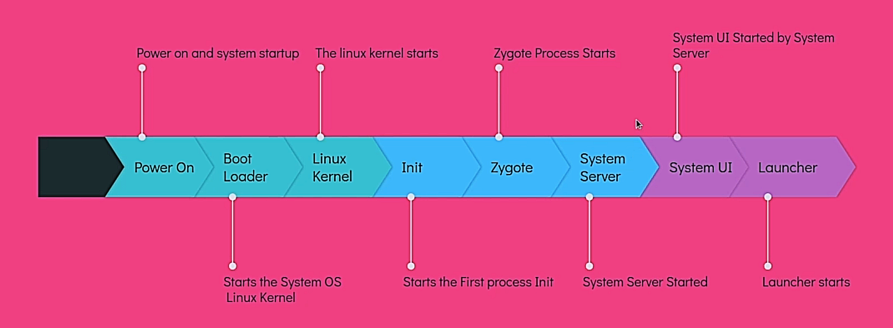

# Android Boot Process

## Power On

The Android boot process begins when the **user presses the power button** to turn on the device.

The power management unit (PMU) initializes, **supplying power to the device's hardware components**.

## Bootloader

The bootloader is a **piece of software** that **runs before the Android operating system starts** up.

It is stored in a **dedicated**, **read-only memory** section.

It conducts **basic hardware checks**.

Then bootloader proceeds to **load the kernel into memory** (System OS).

## Kernel

The kernel is the core of the operating system, responsible for managing hardware resources, memory, and system processes.

It initializes device drivers and sets up essential data structures.

## Init

Tasks performed by init include:

- Creates file system and mounts the device
- Set up SELinux policies
- Initialize the start Property Service (Initializes the properties within the system)
- Parse the init.rc configuration file and start Zygot process

> Note: SELinux stands for Security Enhanced Linux.
>
> It is a Linux kernel security module that provides a mechanism for supporting access control security policies.
>
> They are set of rules, that improve the security of the system.

## Zygote

Zygote is a **parent process** that **creates and manages all the application processes**.

It will create a **ART** when it starts.

It starts the **SystemServer** process.

Then It will call runSelectLoop() method, which will wait for the request from the **ActivityManagerService**.

It creates **App Process** and **System Server** by **fork mechanism**.

## System Server

System Server is a **parent process** that **creates and manages all the system services**.

It calls three methods:

- **startBootstrapServices()**
- **startCoreServices()**
- **startOtherServices()**

Services started by **startBootstrapServices()** method are:

- Installer
- ActivityManagerService
- PowerManagerService
- LightsService
- DisplayManagerService
- SensorService
- PackageManagerService

Services started by **startCoreServices()** method are:

- BatteryService
- UsageStatsService
- GpuService
- WebViewUpdateService

Services started by **startOtherServices()** method are:

- CameraService
- AlarmManagerService
- InputManagerService
- WindowManagerService
- BluetoothService
- NotificationManagerService
- LocationManagerService
- AudioService

## System UI

It initializes the the System UI components.

System UI refers to any element displayed on the screen that is not part of an app.

- Status bar
- Navigation bar 
- Recent apps screen
- PowerUI
- VolumeUI
- PipUI (Picture-in-Picture)
- Stack Divider (Split Screen)

