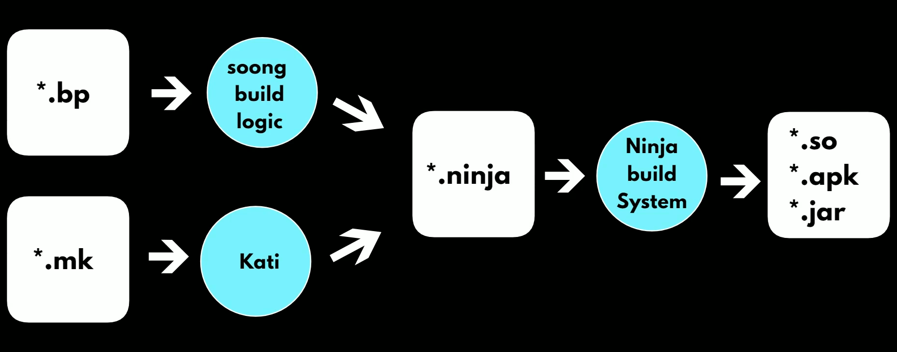
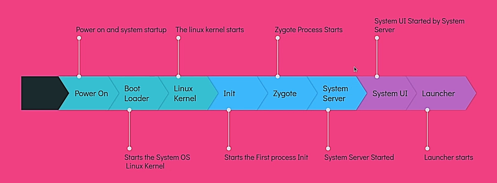

# Table of Contents

[1. Introduction](#introduction)

[2. Android Architecture](#android-architecture)

[3. AOSP Setup In Linux](#aosp-setup-in-linux)

[4. Android Build System](#android-build-system)

[5. AOSP Source Code](#aosp-source-code)

[6. Android Boot Process](#android-boot-process)

[7. Android Overlays](#android-overlays)

[8. ADB](#adb)

[9. SELinux](#selinux)

# Introduction

AOSP stands for Android Open Source Project.

It is an **open-source software stack** and **development platform** for mobile devices, led by Google.

AOSP **provides the foundational code and tools** necessary for building Android operating systems, allowing manufacturers and developers to create customized versions of the Android OS for a wide range of devices.

# Android Architecture


## Application Layer (System Apps)

Both built-in and third-party applications belong to the application layer.

## Application Framework Layer (Java API Framework)

The application framework layer provides developers with the APIs needed to develop applications.

This layer is written in Java.

- **Activity Manager** : Manages the lifecycle of applications and provides a common navigation backstack.
- **Location Manager** : Provides APIs to determine the location of the device.
- **Package Manager** : Manages the applications installed on the device.
- **Notification Manager** : Allows applications to display alerts and notifications to the user.
- **Resource Manager** : Provides access to non-code embedded resources such as strings, color settings, and user interface layouts.
- **Telephony Manager** : Provides information about the telephony services on the device.
- **Window Manager** : Manages the windowing system on the device.
- **Content Providers** : Allows applications to publish and share data with other applications.
- **View System** : An extensible set of views used to create application user interfaces.

## Libraries and Android Runtime Layer

### C/C++ Libraries

The libraries in this layer are written in C or C++.

- **Webkit** : Provides a web browser engine used to display web content.
- **OpenMAX AL** : Provides a standardized interface for audio, video, and image codecs.
- **Libc** : Provides a subset of the standard C library (libc), used by the majority of C-based applications.
- **OpenGL|ES** : Provides an interface between software and graphics acceleration hardware.
- **Media Framework** : Provides a unified interface for playing and recording audio and video.
- **SQLite** : Provides a lightweight relational database engine used to access a variety of relational database systems.
- **SSL** : Provides a secure sockets layer (SSL) implementation used to access a variety of secure communications protocols.

### Android Runtime

- **ART/Dalvik Virtual Machine** : A virtual machine optimized for mobile devices, allowing multiple instances of the Virtual Machine to run efficiently in a limited amount of memory. Each Dalvik application runs in its own process, with its own instance of the Dalvik Virtual Machine, and is executed in a separate Linux process.

> Note: Dalvik Virtual Machine is deprecated in Android 4.4 KitKat and replaced by Android Runtime (ART).
>
> This is because Dalvik Virtual Machine uses Just-In-Time (JIT) compilation, which compiles the code when it is needed, while Android Runtime uses Ahead-Of-Time (AOT) compilation, which compiles the code when the application is installed.
>
> This makes Android Runtime faster than Dalvik Virtual Machine.

- **Core Library** : Provides most of the functionality of the Java programming language that are required by the Java API framework and the apps running on Android.

## Hardware Abstraction Layer (HAL)

The hardware abstraction layer (HAL) provides standard interfaces that expose device hardware capabilities to the higher-level Java API framework.

It is the interface between Operating System Kernel and the hardware.

To protect the Intellectual Property rights of the Hardware manufacturers, the source code of the HAL is not available in the Android Open Source Project (AOSP).

And it provides a virtual hardware platform for the operating system.

So that it has hardware independence, and it can be transported to any device.

## Linux Kernel

Android's core system services are based on Linux and are written in C/C++.

The Linux kernel is responsible for managing the core system services such as security, memory management, process management, network stack, and driver model.

It also provides an abstraction layer between the hardware and the rest of the software stack.

# AOSP Setup in Linux

Hardware Requirements :

- 64-bit environment
- 250GB + 150GB disk space
- 16GB RAM minimum (64GB recommended by Google)

Software Requirements :

- Ubuntu 18.04 LTS

For detailed information, [Refer Android Docs](https://source.android.com/docs/setup/start/requirements)

## Install Required Packages

```bash
sudo apt-get install git-core gnupg flex bison build-essential zip curl zlib1g-dev libc6-dev-i386 libncurses5 x11proto-core-dev libx11-dev lib32z1-dev libgl1-mesa-dev libxml2-utils xsltproc unzip fontconfig
```

For detailed information, [Refer Android Docs](https://source.android.com/docs/setup/start/initializing)

## Install Source Control Tool

Working with Android code requires using both Git (an open-source version-control system) and Repo (a Google-built repository-management tool that runs on top of Git).

```bash
sudo apt-get update
sudo apt-get install repo
```

For detailed information, [Refer Android Docs](https://source.android.com/docs/setup/download)

## Download the Source

### Initializing a Repo client

```bash
mkdir WORKING_DIRECTORY
cd WORKING_DIRECTORY
```

```bash
git config --global user.name Your Name
git config --global user.email you@example.com
```

```bash
repo init -u https://android.googlesource.com/platform/manifest -b BRANCH_NAME
```

### Downloading the Android source tree

```bash
repo sync
```

For detailed information, [Refer Android Docs](https://source.android.com/docs/setup/download/downloading)

## Building Android

### Setting up the environment

Initialize the environment with the `envsetup.sh` script:

```bash
. build/envsetup.sh
```

### Choosing a target

Choose which target to build with `lunch`.

```bash
lunch aosp_arm-eng
```

### Building the code

```bash
m
```

Build everything with m.

### Running the Build

You can either run your build on an emulator or flash it on a device.

Because you've already selected your build target with lunch, it's unlikely to run on a different target than it was built for.

**Flashing with fastboot**
To flash a device, use fastboot, which should be included in your path after a successful build.

**Emulating an Android device**
The emulator is added to your path automatically by the build process. To run the emulator, type:

```bash
emulator
```

For detailed information, [Refer Android Docs](https://source.android.com/docs/setup/build/building)

# Android Build System



## envsetup

```bash
source build/envsetup.sh
```

The `envsetup.sh` script imports several commands that enable you to work with the Android source code.

To see the full list of available commands, run:

```bash
hmm
```

## envsetup commands

### lunch

The `lunch` command is used to configure the build environment for a specific target device or product variant, enabling developers to compile and build the Android OS for that device.

It sets up the build environment with the necessary parameters for the chosen configuration, making it a convenient way to prepare the build system before compilation.

---

### croot

The `croot` command is used to change the current directory to the top of the Android source tree.

```bash
croot
```

---

### m

The `m` command is used to build the Android source code.

It makes from top of the source tree.

```bash
m
```

---

### mm

Builds all of the modules in the **current directory**, and but **not** their dependencies.

Inside the module directory (For example, `packages/apps/Calendar/`), run:

```bash
mm
```

This only builds the module. It does not generate the final image.

Final image is generated by `m` command.

> Note: It is useful when we make modification to a module and check if it is building successfully or not.

---

### mma

Builds all of the modules in the **current directory**, and their dependencies.

---

### mmm

Builds all of the modules in the **supplied directories**, and but **not** their dependencies.

Inside the directory (For example, `packages/apps/`), run:

```bash
mmm Calendar launcher3
```

This only builds the module. It does not generate the final image.

> Note: It is useful when we make modification to some modules and check if they are building successfully or not.

---

### mmma

Builds all of the modules in the **supplied directories**, and their dependencies.

---

### grep

The `grep` command is a Linux command that searches for text and strings in a file.

It's short for `global regular expression print`.

- **cgrep** : Greps on all local C/C++ files.
- **ggrep** : Greps on all local Gradle files.
- **jgrep** : Greps on all local Java files.
- **resgrep** : Greps on all local res/\*.xml files.
- **mangrep** : Greps on all local AndroidManifest.xml files.
- **mgrep** : Greps on all local Makefiles files.
- **sepgrep** : Greps on all local sepolicy files.
- **sgrep** : Greps on all local source files.

```bash
cgrep "wifi"
```

---

### modules

- **godir** : Go to the directory containing a file.
- **allmod** : List all modules.
- **gomod** : Go to the directory containing a module.
- **pathmod** : Get the directory containing a module.
- **refreshmod** : Refresh list of modules for allmod/gomod.

```bash
gomod launcher3
```

# AOSP Source Code

## art

ART (Android Runtime) operating environment is located in the `art/` directory.

It also includes dex complier, JVM, JIT, Dalvik VM etc.

## bionic

This directory contains the **C library** (libc) used by Android.

It includes low-level system components like the standard C library, **dynamic linker**, and other essential **runtime components**.

## bootable

This directory contains the **bootloader** (which is responsible for **loading the Android kernel** and **initiating the system boot process**), recovery image, and other low-level system software that is typically loaded before the kernel.

## build

Directory contains the **build system** for Android.

It includes **tools and scripts** for **building** the entire Android system, **managing dependencies**, and **generating the final system images**.

Contains :

- `envsetup.sh` script that initializes the build environment.
- `Android.mk` file that defines the build rules for the entire Android system.
- make and soong build systems.

## cts

Contains the Compatibility Test Suite (CTS) for Android.

CTS is used to **check for incompatibilities** with Android OS **during device development**.

## dalvik

It contains the Dalvik Virtual Machine related code.

Even though ART is the default runtime environment for Android, android still uses Dalvik VM for **running apps that are not compiled with ART**.

It also contains **dex code generator**, and Dalvik exchange.

## developers

Contains demo and **sample android projects**.

## development

It includes **tools** for debugging, profiling, and testing Android applications.

## device

It contains **device specific files and configurations**.

It includes supporting configuration and driver files required for Development boards like linaro, hikey etc.

## external

Includes **external projects and libraries** that Android uses but are not part of the core AOSP.

These could be **open-source projects** or third-party libraries.

For example, **Dagger2**

## frameworks

Contains the **core Android system framework**.

We can find all the **System service**(`ActivityManagerService.java`, `PackageManagerService.java`), **libraries**, and **APIs** that are used by the Android system.

## hardware

Contains the hardware abstraction layer (HAL) for Android.

It consists of HAL for audio, video, TV, camera, USB, and other hardware components.

Contains **hardware-specific code**, including drivers for various hardware components like sensors, cameras, and audio devices.

## kernel

It contains the **kernel configuration** and **prebuilts**.

## libcore

The `/libcore` directory includes **core libraries used by the Android system**.

These libraries provide **fundamental functionality for Java** applications on Android, such as **I/O operations**, utilities, and **networking**.

## libnativehelper

This directory contains **helper code for native development** .

It provides support for integrating native (C/C++) code with the Java-based Android framework.

## out

**After the build is complete**, the output is placed in the `/out` directory.

The `/out` directory is where the build system places the output artifacts, including compiled binaries, libraries, and **system images**.

## packages

The `/packages` directory includes various **Android applications and system packages**.

It contains source code for apps like the Android Browser, Calculator, Calendar, and others.

## pdk

The Platform Development Kit (PDK) includes **tools and documentation for building Android devices**.

It provides **resources for device manufacturers** to create Android-compatible hardware.

It includes only necessary components for developing HAL.

## platform_testing

Consists of **platform tests modules**.

## prebuilts

The `/prebuilts` directory contains prebuilt binaries and tools that are used in the Android build process.

It includes toolchains like **asuite**, **android emulator**, bazel etc.

## sdk

It contains **instructions and tools for building the Android SDK**, for a specific build.

## system

It contains **low level file system libraries**, applications and components.

Folders for **SELinux**, Logging and many low level configuration files.

## test

It contains **test suits** like csuite, vts(vendor test suite), mts(mainline test suite) etc.

## toolchain

It contains **files related to benchmark** and **pgoprofiles**.

## tools

It contains **tools like apksig, asuite, trade federation** etc.

# Android Boot Process



## Power On

The Android boot process begins when the **user presses the power button** to turn on the device.

The power management unit (PMU) initializes, **supplying power to the device's hardware components**.

## Bootloader

The bootloader is a **piece of software** that **runs before the Android operating system starts** up.

It is stored in a **dedicated**, **read-only memory** section.

It conducts **basic hardware checks**.

Then bootloader proceeds to **load the kernel into memory** (System OS).

## Kernel

The kernel is the core of the operating system, responsible for managing hardware resources, memory, and system processes.

It initializes device drivers and sets up essential data structures.

## Init

Tasks performed by init include:

- Creates file system and mounts the device
- Set up SELinux policies
- Initialize the start Property Service (Initializes the properties within the system)
- Parse the init.rc configuration file and start Zygot process

> Note: SELinux stands for Security Enhanced Linux.
>
> It is a Linux kernel security module that provides a mechanism for supporting access control security policies.
>
> They are set of rules, that improve the security of the system.

## Zygote

Zygote is a **parent process** that **creates and manages all the application processes**.

It will create a **ART** when it starts.

It starts the **SystemServer** process.

Then It will call runSelectLoop() method, which will wait for the request from the **ActivityManagerService**.

It creates **App Process** and **System Server** by **fork mechanism**.

## System Server

System Server is a **parent process** that **creates and manages all the system services**.

It calls three methods:

- **startBootstrapServices()**
- **startCoreServices()**
- **startOtherServices()**

Services started by **startBootstrapServices()** method are:

- Installer
- ActivityManagerService
- PowerManagerService
- LightsService
- DisplayManagerService
- SensorService
- PackageManagerService

Services started by **startCoreServices()** method are:

- BatteryService
- UsageStatsService
- GpuService
- WebViewUpdateService

Services started by **startOtherServices()** method are:

- CameraService
- AlarmManagerService
- InputManagerService
- WindowManagerService
- BluetoothService
- NotificationManagerService
- LocationManagerService
- AudioService

## System UI

It initializes the the System UI components.

System UI refers to any element displayed on the screen that is not part of an app.

- Status bar
- Navigation bar
- Recent apps screen
- PowerUI
- VolumeUI
- PipUI (Picture-in-Picture)
- Stack Divider (Split Screen)

# Android Overlays

Resource overlay refers to the **ability to customize or extend resources**, such as layouts, drawables, or strings, **without modifying the original source code** or resources of an Android application.

A runtime resource overlay (RRO) is a package that **changes the resource values** of a target **package at runtime**.

It overlays the resources of the system with the resources of the app, **during the runtime** of the app.

In simple terms, it is a APK with only Resources.

> This concept is particularly useful for **creating variations of an app** for different devices or regions without duplicating the entire codebase.

## Static Overlays

Static overlays are enabled at build time, and cannot be disabled later.

In order to change the static overlay, you need to rebuild the ROM.

## Dynamic Overlays

Dynamic overlays are enabled at runtime, and can be enabled or disabled later, programatically.

# ADB

Android Debug Bridge (ADB) is a versatile command line tool that lets you communicate with an emulator instance.

Used for various purposes, including:

- Installing apps
- Debugging apps
- Accessing Unix shell of the device

## adb Commands

- `adb devices`: Lists all connected Android devices or emulators.
- `adb install <path-to-apk>`: Installs an APK on the connected device.
- `adb uninstall <package-name>`: Uninstalls an app from the connected device.
- `adb logcat`: Displays real-time logs from the device, useful for debugging.
- `adb shell`: Opens a shell on the device for executing commands directly.
- `adb pull <remote-path> <local-path>`: Copies a file from the device to the local machine.
- `su` : Used to switch to the superuser (root) account

# SELinux

SELinux, which stands for Security-Enhanced Linux, is a set of security extensions implemented in the Linux kernel to enhance the overall security of the operating system.

SELinux is a security framework integrated into the Linux kernel. It provides a set of access control policies and mechanisms that go beyond traditional Linux permissions.

It is a MAC(Mandatory Access Control) security mechanism in android.

It is a set of rules that are enforced by the kernel.

It restricts the actions that processes and users can perform on the system.

> SELinux uses a policy language that specifies rules for how processes and users interact with various system resources.

This enhances overall system security by mitigating the impact of potential security vulnerabilities and unauthorized access.

---

SELinux depends on lables to enforce access control.

> Labels are used to identify the type of a process, match actions and policies.

---

SELinux operates on the priciple of Default Denial. That is, everything is denied unless explicitly allowed.

## Global Modes

SELinux can operare on two global modes:

- Permissive Mode
  - Permission denials are logged but are not enforced.
- Enforcing Mode
  - Permission denials are logged and are enforced.

Android includes SELinux in enforcing mode.

> In Enforcing mode, disallowed actions are logged and denied.

## Types of Access Control Models

- MAC (Mandatory Access Control)

  - The system determines which subjects(android processes) can access which objects(files, sockets, ports, etc.).

- DAC (Discretionary Access Control)
  - The owner of an object specifies which subjects can access the object.

---

Rules are defined in `*.te` files
